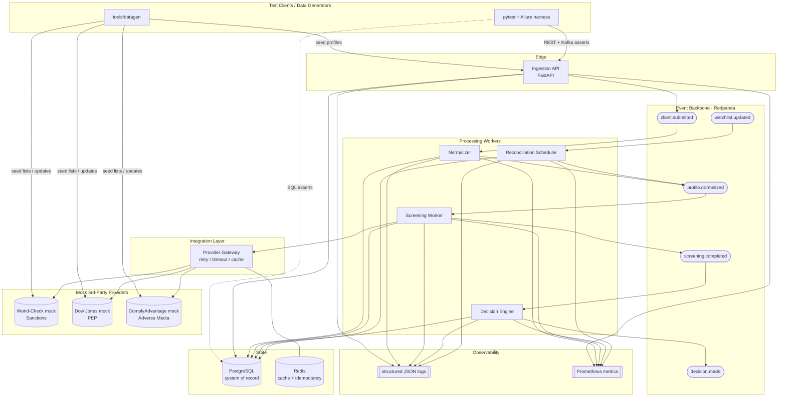

# 01 — System Architecture: AML-Sentinel

## 1. Main functionality

AML-Sentinel screens client KYC profiles against external high-risk watchlists and produces an auditable risk decision. The pipeline is intentionally event-driven so an SDET can practice testing asynchronous data quality.

Capabilities, in business terms:

1. **Ingest** a client KYC profile (name, DOB, nationality, residence country, document IDs) via REST or a Kafka event.
2. **Normalize** the profile: transliterate non-Latin names, standardize dates, split/parse name parts, canonicalize country codes.
3. **Screen** the normalized profile against three categories of external lists — **Sanctions**, **PEP** (Politically Exposed Persons), **Adverse Media** — served by mocked third-party providers.
4. **Fuzzy-match** names (typos, aliases, transliteration variants, name-order differences) and produce scored candidate matches.
5. **Decide**: apply a rules engine to candidate matches → `CLEAR` / `FLAG` / `ESCALATE`.
6. **Persist + audit**: write profile, matches, decision, and an immutable audit record to PostgreSQL.
7. **Reconcile**: when a watchlist publishes an update (new entry / removed entry / new list version), re-screen affected clients and detect status drift.
8. **Observe**: emit structured logs and data-quality metrics at every stage, all correlated by `trace_id`.

## 2. Tech stack

| Layer | Technology | Why (mirrors Exness where possible) |
|-------|-----------|-------------------------------------|
| Service language | **Python 3.12** (FastAPI) | Matches the SDET's primary language; fast to build/verify. Go is the `[STRETCH]` track. |
| Messaging | **Redpanda** (Kafka API-compatible) | Kafka semantics without the JVM/Zookeeper weight; same client code as real Kafka. |
| Relational DB | **PostgreSQL 16** | Matches Exness; target for SQL data-quality tests. |
| Cache / dedupe | **Redis 7** | Provider-response cache + idempotency key store. |
| Containerization | **Docker + Docker Compose** | Matches Exness; one-command local SUT. |
| CI | **GitLab CI** (`.gitlab-ci.yml`) + GitHub Actions alt | Matches Exness GitLab CI. |
| Migrations | **Alembic** | Versioned schema, itself a test target. |
| Fuzzy matching | **rapidfuzz** + **unidecode** | Name similarity + transliteration. |
| Mock providers | **FastAPI stub services** (or WireMock) | Stand in for World-Check / Dow Jones / ComplyAdvantage. |
| Test framework | **pytest + Allure + testcontainers** | The SDET deliverable; matches Exness (pytest/Allure). |
| Logging | **structlog** (JSON) | Machine-parseable stage logs. |
| Metrics | **prometheus-client** (+ optional Grafana) | Data-quality + throughput metrics. |
| Data generation | **Faker** (seeded) + curated fixtures | Deterministic profiles + planted watchlist matches. |

## 3. Technical architecture

AML-Sentinel is a small set of cooperating components around a Kafka backbone and a Postgres system of record. Each box below is a deployable unit in `docker-compose.yml`.

### 3.1 Component responsibilities

- **Ingestion API** (`api/`): validates inbound KYC payloads, writes a `raw_profile` row, emits `client.submitted`. Stateless, horizontally scalable.
- **Normalizer worker** (`workers/normalize.py`): consumes `client.submitted`, produces a canonical profile, emits `profile.normalized`.
- **Provider Gateway** (`providers/`): single client facade over the three mock providers; handles timeouts, retries, circuit-breaking, and Redis caching keyed by `(provider_id, normalized_name_hash, list_version)`.
- **Screening worker** (`workers/screen.py`): consumes `profile.normalized`, queries the gateway, runs fuzzy matching, persists `match` rows, emits `screening.completed`.
- **Decision engine** (`workers/decide.py` + `decisioning/`): consumes `screening.completed`, applies rules, writes `decision` + `audit` rows, emits `decision.made`.
- **Reconciliation scheduler** (`workers/reconcile.py`): consumes `watchlist.updated`, bumps `list_version`, re-screens affected clients, records drift.
- **PostgreSQL**: system of record (see §5 data, doc 02 §schemas).
- **Redis**: provider cache + idempotency keys.
- **Redpanda**: event backbone.
- **Mock providers ×3**: external watchlist APIs.
- **Observability**: every component emits structured logs + Prometheus metrics.

### 3.2 Architecture diagram

## 4. Data (overview — full schemas in doc 02)

Generated data falls into four families (full instructions in `docs/04_data_generation.md`):

- **Client profiles** — clean, dirty, edge-case, and adversarial KYC records.
- **Watchlists** — per-provider sanctions / PEP / adverse-media entries with *planted* matches.
- **Golden datasets** — input→expected-output pairs for normalization, matching, and decisioning.
- **List updates** — deltas (adds/removes/version bumps) to drive reconciliation tests.

## 5. Logs (overview — full spec in doc 02 §Logs)

Each stage emits exactly one structured JSON log line on success and one on failure, both carrying `trace_id`, `client_id`, `stage`, `status`, and a stage-specific payload. The log stream is itself a test surface: the harness asserts that a `trace_id` appears at every expected stage exactly once and never out of order.

## 6. Keys & dependencies required to test data quality across the system

These identifiers are the "seams" an SDET uses to verify correctness as data crosses component boundaries. Every one must be deterministic and propagated unchanged.

| Key | Generated at | Propagated through | Used to verify |
|-----|--------------|--------------------|----------------|
| `trace_id` (UUIDv7) | Ingestion API | every topic, every DB row, every log | End-to-end lineage; "did this profile reach every stage exactly once?" |
| `client_id` | Caller / generator | all stages | Correlate a real-world client across tables |
| `profile_hash` (sha256 of canonical profile) | Normalizer | screening, cache key | Detect normalization non-determinism; cache correctness |
| `idempotency_key` (= `trace_id` + topic + offset) | Each consumer | Redis set | Prove no duplicate processing on redelivery |
| `screening_id` | Screening worker | matches, decision, audit | Tie candidate matches to a screening run |
| `match_id` | Screening worker | decision, audit | Tie a decision to specific evidence |
| `provider_id` | Provider gateway | match, cache, audit | Attribute a match to a source (sanctions vs PEP vs media) |
| `list_version` | Mock provider | match, reconciliation, audit | Reconciliation correctness; "was this screened against the current list?" |
| `decision_id` | Decision engine | audit, `decision.made` | Decision traceability |
| `audit_id` | Decision engine | — (terminal) | Immutable evidence record |
| Kafka `(topic, partition, offset)` | Redpanda | consumers | Ordering, replay, and exactly-once-ish assertions |
| DB PK/FK constraints | Migrations | — | Referential integrity; orphan-row detection |
| `expected_outcome` (golden label) | Data generator | test assertions | Ground truth for match/decision accuracy |

**Dependency/readiness checks** the harness needs before running: Postgres reachable + migrated; Redpanda topics created; Redis up; all three mock providers returning `200 /health` with a known seeded `list_version`. These become pytest session-scoped fixtures.

## 7. Mocks for components and third parties not feasible to run for real

| Real-world thing | Mock approach | Behaviors the mock must support (so the SDET can test them) |
|------------------|---------------|-------------------------------------------------------------|
| **World-Check / Refinitiv** (Sanctions) | FastAPI stub `mocks/world_check` | Query by name/DOB → return planted matches; expose `list_version`; configurable latency + 5xx injection; pagination |
| **Dow Jones R&C** (PEP) | FastAPI stub `mocks/dow_jones` | PEP tiers (1–4), aliases, partial DOB; configurable timeouts |
| **ComplyAdvantage** (Adverse Media) | FastAPI stub `mocks/comply_advantage` | Free-text media hits with confidence; duplicate/near-duplicate articles to test dedupe |
| **Provider non-determinism / outages** | Mock control endpoints (`POST /_control/fault`) | Force timeout, 500, slow response, empty body, malformed JSON — to test gateway resilience |
| **Watchlist update feed** | Generator emits to `watchlist.updated` + bumps mock `list_version` | Drives reconciliation without a real feed |
| **Kafka (for unit tests)** | In-memory fake or testcontainers Redpanda | Fast unit tests vs realistic integration tests |
| **System clock (reconciliation timing)** | Injectable `Clock` abstraction + `freezegun` | Deterministically trigger scheduled re-screening |
| **Outbound notifications/alerts** | Capture-only sink (`mocks/alert_sink`) records payloads | Assert alerting fires on data-quality breaches without sending anything |

**Mock design rules:** every mock is (a) seedable to the same dataset the generators produce, (b) controllable via a `/_control/*` API for fault injection, and (c) observable via `/health` and `/_state` so fixtures can assert preconditions. Mocks must never embed business logic that belongs in the SUT — they only return data and faults.
