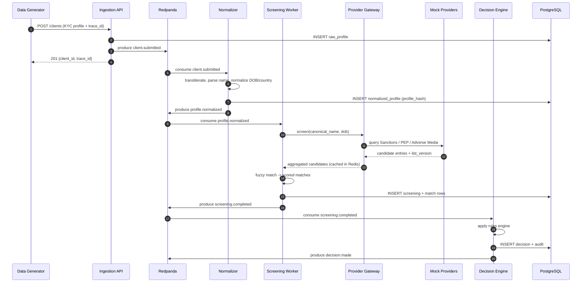
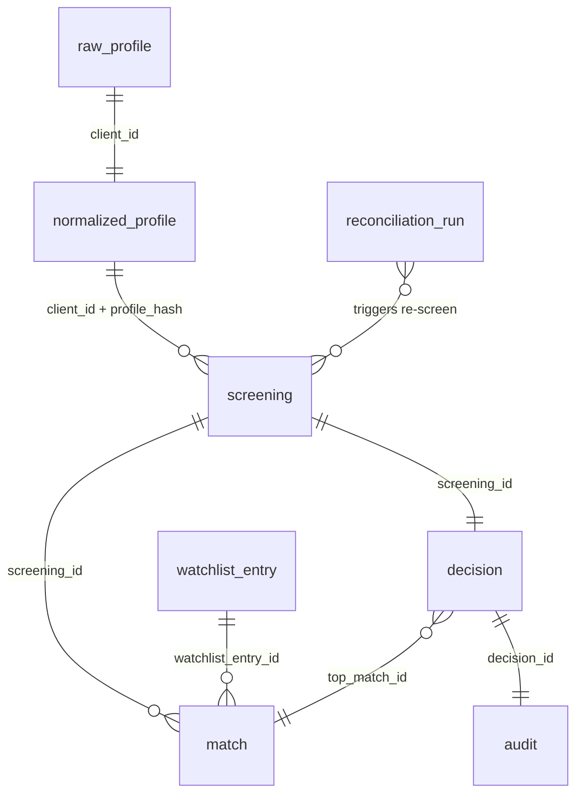
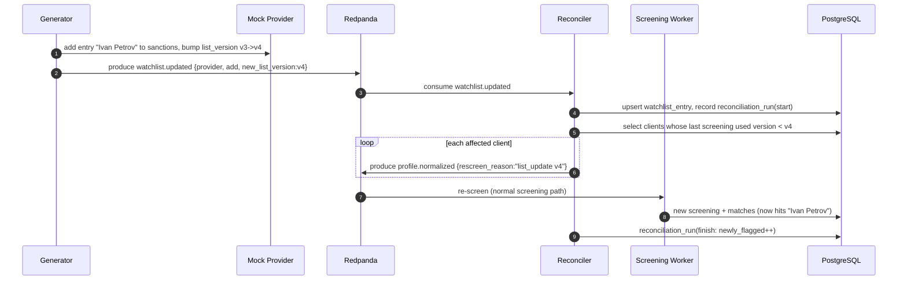

# 02 — Data Flows: AML-Sentinel

This doc defines every message, table, and log line, plus the happy-path and reconciliation flows. It is the contract the workers and the test harness both build against.

## 1. Topics (Redpanda / Kafka)

| Topic | Key | Producer | Consumer | Partitions |
|-------|-----|----------|----------|------------|
| `client.submitted` | `client_id` | Ingestion API | Normalizer | 3 |
| `profile.normalized` | `client_id` | Normalizer, Reconciler | Screening worker | 3 |
| `screening.completed` | `client_id` | Screening worker | Decision engine | 3 |
| `decision.made` | `client_id` | Decision engine | (sink / harness) | 3 |
| `watchlist.updated` | `provider_id` | Generator / mock | Reconciler | 1 |

Keying by `client_id` guarantees per-client ordering within a partition — important for the reconciliation re-screen flow.

## 2. Event envelope (all messages share this)

```json
{
  "trace_id": "uuidv7 string",
  "client_id": "string",
  "event_type": "client.submitted | profile.normalized | screening.completed | decision.made | watchlist.updated",
  "schema_version": 1,
  "produced_at": "RFC3339 timestamp",
  "producer": "ingestion-api | normalizer | screening-worker | decision-engine | reconciler",
  "payload": { }
}
```

`payload` shapes per event:

- **client.submitted**: the raw KYC profile (see §4.1 `raw_profile`).
- **profile.normalized**: `{ profile_hash, canonical_name, name_parts, dob_iso, nationality_iso2, residence_iso2, document_ids[], rescreen_reason? }`.
- **screening.completed**: `{ screening_id, profile_hash, list_versions{}, matches:[{match_id, provider_id, list_type, matched_name, score, dob_match, evidence_ref}] }`.
- **decision.made**: `{ decision_id, screening_id, outcome, reason_codes[], top_match_id?, decided_at }`.
- **watchlist.updated**: `{ provider_id, list_type, change:"add|remove|version_bump", entry?, new_list_version }`.

## 3. End-to-end happy-path flow



## 4. Database schema (PostgreSQL)

All tables include `trace_id` and `created_at`. Foreign keys enforce lineage; the harness uses them to find orphans.

### 4.1 `raw_profile`
`id PK`, `client_id UNIQUE`, `trace_id`, `raw_payload JSONB`, `source` (`rest|kafka`), `created_at`.

### 4.2 `normalized_profile`
`id PK`, `client_id FK→raw_profile.client_id`, `trace_id`, `profile_hash`, `canonical_name`, `name_parts JSONB`, `dob_iso DATE`, `nationality_iso2`, `residence_iso2`, `document_ids JSONB`, `created_at`. Unique on `(client_id, profile_hash)`.

### 4.3 `watchlist_entry` (local mirror of provider data)
`id PK`, `provider_id`, `list_type` (`sanctions|pep|adverse_media`), `list_version`, `entity_name`, `aliases JSONB`, `dob_iso DATE NULL`, `country_iso2 NULL`, `risk_payload JSONB`, `is_active BOOL`, `created_at`.

### 4.4 `screening`
`id PK (screening_id)`, `client_id`, `trace_id`, `profile_hash`, `list_versions JSONB`, `status` (`completed|failed`), `screened_at`.

### 4.5 `match`
`id PK (match_id)`, `screening_id FK`, `provider_id`, `list_type`, `watchlist_entry_id FK NULL`, `matched_name`, `score NUMERIC(5,4)`, `dob_match BOOL`, `created_at`.

### 4.6 `decision`
`id PK (decision_id)`, `screening_id FK UNIQUE`, `client_id`, `trace_id`, `outcome` (`CLEAR|FLAG|ESCALATE`), `reason_codes JSONB`, `top_match_id FK NULL`, `decided_at`.

### 4.7 `audit`
`id PK (audit_id)`, `decision_id FK`, `trace_id`, `snapshot JSONB` (immutable copy of inputs+matches+rule trace), `created_at`. **Append-only** (no UPDATE/DELETE; enforced by a DB rule or trigger — itself a test target).

### 4.8 `idempotency` (or store in Redis)
`key PK` (`trace_id:topic:offset`), `processed_at`.

### 4.9 `reconciliation_run`
`id PK`, `provider_id`, `list_type`, `old_version`, `new_version`, `clients_rescreened INT`, `newly_flagged INT`, `newly_cleared INT`, `started_at`, `finished_at`.

### 4.10 ER diagram



## 5. Reconciliation flow



**Key reconciliation invariant to test:** a client who was `CLEAR` against `v3` and matches a name added in `v4` must end up `FLAG`/`ESCALATE` after reconciliation, with a fresh `screening` row referencing `v4` and an `audit` snapshot citing the new entry.

## 6. Logs (structured JSON)

One line per stage. Schema:

```json
{
  "ts": "RFC3339",
  "level": "INFO | WARNING | ERROR",
  "trace_id": "uuidv7",
  "client_id": "string",
  "stage": "ingest | normalize | screen | decide | reconcile",
  "status": "ok | failed",
  "component": "ingestion-api | normalizer | ...",
  "duration_ms": 12,
  "detail": { }
}
```

Stage-specific `detail`:
- `normalize`: `{ profile_hash, transliterated: bool, fields_defaulted: [] }`
- `screen`: `{ screening_id, providers_queried, candidates, matches, max_score, cache_hits }`
- `decide`: `{ decision_id, outcome, reason_codes }`
- `reconcile`: `{ reconciliation_run_id, new_list_version, clients_rescreened }`
- on `failed`: `{ error_type, error_msg }` (no PII beyond `client_id`)

**Log-based data-quality assertions the harness will make:**
1. For each `trace_id`, stages appear in order `ingest → normalize → screen → decide` with no gaps and no duplicates.
2. `screen.detail.matches == COUNT(match WHERE screening_id=...)` — logs agree with DB.
3. Any `status:"failed"` produces a corresponding dead-letter record and no partial DB write (atomicity).
4. `cache_hits` increments on repeated identical profiles (cache correctness).

## 7. Data-quality check catalog (where the SDET earns the role)

These run as scheduled checks in the SUT **and** as pytest assertions. Each maps to a real AML risk.

| Check | SQL/assertion shape | Risk if it fails |
|-------|---------------------|------------------|
| **Completeness** | every `raw_profile` has exactly one `normalized_profile` | dropped clients = unscreened high-risk |
| **No orphans** | no `match` without a `screening`; no `decision` without a `screening` | broken lineage = indefensible audit |
| **Lineage integrity** | `trace_id` identical across all rows for a client | can't prove what was screened |
| **Decision coverage** | every `screening(status=completed)` has exactly one `decision` | unreviewed clients |
| **Freshness / reconciliation** | no active client screened against a stale `list_version` | screening against outdated sanctions |
| **Idempotency** | redelivering offset N creates 0 new rows | double-counting, inflated metrics |
| **Match accuracy** | golden set: precision/recall within thresholds | false negatives = compliance breach |
| **Audit immutability** | UPDATE/DELETE on `audit` rejected | tampered evidence |
| **Determinism** | same profile → same `profile_hash` & same decision | flaky screening |
